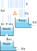
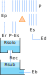

SMAP
----

The Soil Moisture Accounting Procedure (SMAP) is a rainfall-runoff model that
simulates the transformation of precipitation into runoff based on conceptual reservoirs representing different states :cite:`Lopes82`.

The MOGESTpy implementation of SMAP includes two versions: a daily timestep version and a monthly timestep version. Both versions are designed to be flexible and can be calibrated to fit observed data for specific catchments.

Daily timestep
~~~~~~~~~~~~~~

Daily version of SMAP

Examples
^^^^^^^^

To use the daily version of SMAP, you can create an instance of the SmapD class and provide the necessary parameters. Here is an example of how to set up and run a simulation using the daily version of SMAP.

.. code-block:: python

   from mogestpy.quantity.hydrological.smap import SmapD

   model = SmapD(
    Str=100,
    Crec=19.6125,
    Capc=30,
    kkt=47.53,
    k2t=1.430,
    Ai=2,
    Tuin=.05,
    Ebin=0.1,
    Ad=70.2
    )

   precipitations = [10, 20, 15, 5, 0]  # Example precipitation data
   evapotranspirations = [2, 3, 1, 0.5, 0]  # Example evapotranspiration data

   discharges = model.run_to_list(precipitations, evapotranspirations)

Monthly timestep
~~~~~~~~~~~~~~~~

Monthly version of SMAP

Examples
^^^^^^^^

Similarly, to use the monthly version of SMAP, you can create an instance of the SmapM class and provide the necessary parameters. Here is an example of how to set up and run a simulation using the monthly version of SMAP.

.. code-block:: python

   from mogestpy.quantity.hydrological.smap import SmapM

   model = SmapM(
    Str=1000,
    Pes=1,
    Crec=0.5,
    kkt=1.5,
    Tuin=0.5,
    Ebin=0.1,
    Ad=1,
    )

   precipitations = [100, 200, 150, 50, 0]  # Example precipitation data
   evapotranspirations = [20, 30, 10, 5, 0]  # Example evapotranspiration data

   discharges = model.run_to_list(precipitations, evapotranspirations)

.. bibliography:: references.bib